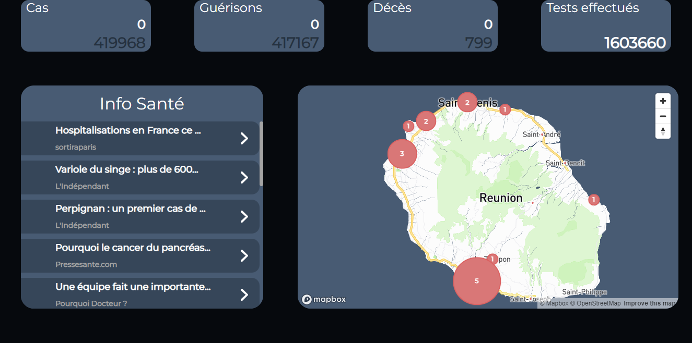

# Application COVID-19 | Réunion (Projet Personnel)
## avec React JS en Localhost
## Version Ordinateur

<div>
    
    <div align="center">
        <h4 topmargin="0" bottommargin="0">Aperçu du site</h4>
    </div>
</div>

### Pour Commencer

Veuillez cloner le projet Git avec Visual Studio Code, Github Desktop ou avec un terminal de commande

### Prérequis

Veuillez installer 
```sh
    npm install 
```

directement dans votre projet.
<br> 
Dès que cela est installé avec votre terminal de commande vous pouvez démarrer votre projet avec
```sh
    npm start
```

Et vous pouvez ouvrir votre projet avec <a href="http://localhost:3000" target="BLANK_">http://localhost:3000</a>