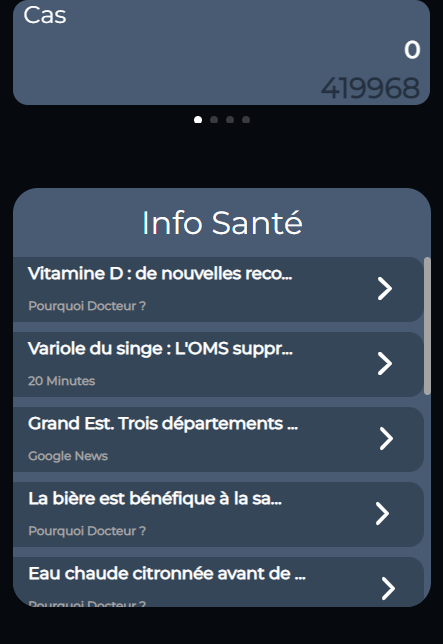

# Application COVID-19 | Réunion (Projet Personnel)
## avec React JS en Localhost
## Version Ordinateur et Mobile

    
    

        <h4 topmargin="0" bottommargin="0">Aperçu du site Ordinateur</h4>
    

    

        
    

    

        <h4 topmargin="0" bottommargin="0">Aperçu du site Mobile</h4>
    

